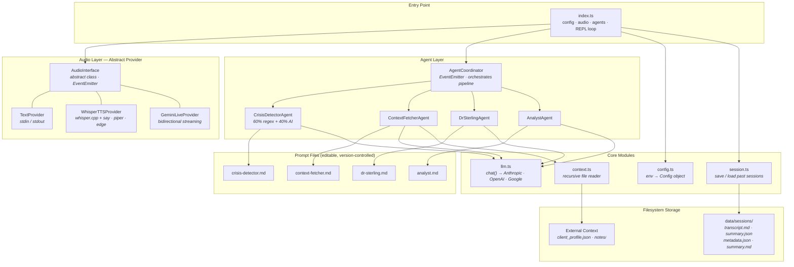
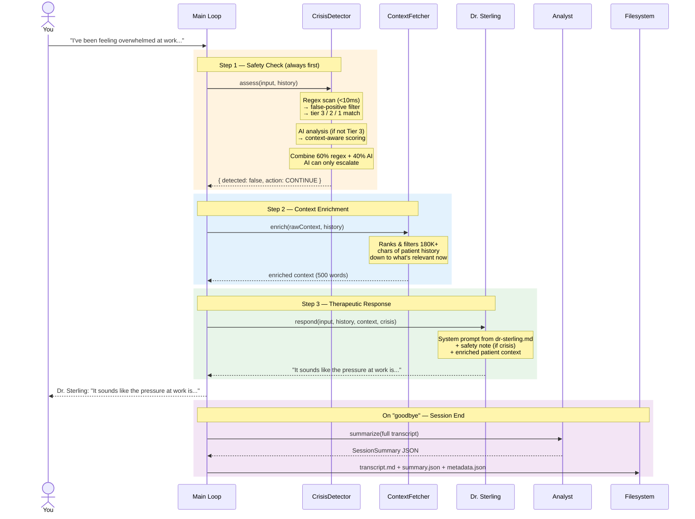
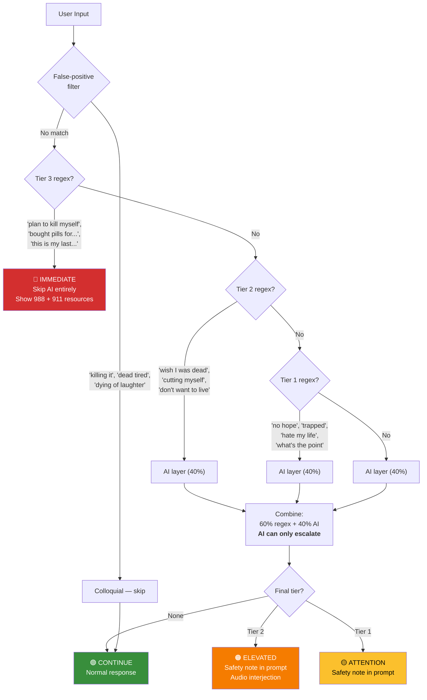
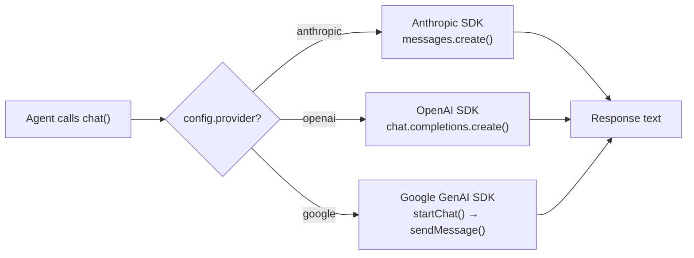

# AI Psychiatrist

A voice-first AI therapist that runs in your terminal. Talk to Dr. Eleanor Sterling -- a warm, concise AI psychiatrist backed by four coordinating agents, hybrid crisis detection, and filesystem-only persistence. No database, no backend server, no Docker.

---

## What Happens When You Talk

You type (or speak). Behind the terminal prompt, four agents handle every message before you see a response:

1. **CrisisDetector** -- regex scans your input in under 10ms, then an AI layer reads the emotional arc of the conversation. The two scores combine 60/40. If the regex catches a Tier 3 pattern (active plan + method), it short-circuits everything and shows crisis resources immediately.

2. **ContextFetcher** -- takes the full background context (patient profile, past session summaries, external notes) and asks the LLM: "what from all of this is relevant to *this* specific exchange?" The therapist only sees what matters right now.

3. **Dr. Sterling** -- the primary therapist agent. Loads its personality from `prompts/dr-sterling.md`, receives the enriched context and any crisis flags, and generates a short (3-4 sentence) response. If a Tier 1-2 crisis was detected, a safety note is injected into the system prompt so the response shifts tone without being heavy-handed.

4. **Analyst** -- runs when you say goodbye. Reads the full transcript and generates a structured JSON summary: topics, emotional journey, key insights, recommendations for next session, and risk assessment.

Sessions build on each other. The last 3 session summaries are loaded at startup, so Dr. Sterling remembers what you talked about last time.

---

## Architecture



---

## Message Processing Pipeline

Every user message passes through this exact sequence:



---

## Crisis Detection

The safety system is the only part that runs deterministic code before touching the LLM. False positives are always safer than false negatives.



**Key design constraints:**
- Tier 3 regex match = immediate response, zero LLM latency, hardcoded crisis resources
- AI layer can only *escalate* the tier -- if regex says Tier 1 and AI says Tier 2, final tier is 2. If regex says Tier 2 and AI says Tier 1, final tier stays 2.
- AI failure falls back to regex-only (safe default)
- False-positive patterns ("killing it at work", "dead serious") are checked before any tier matching

---

## Quick Start

### Prerequisites

- **Node.js 20+**
- **One API key**: Anthropic, OpenAI, or Google

### Install

```bash
git clone https://github.com/neerazz/ai-psychiatrist.git
cd ai-psychiatrist
npm install
```

### Configure

```bash
cp .env.example .env
```

Open `.env` and set your API key:

```bash
AI_MODEL=claude-sonnet-4-5
ANTHROPIC_API_KEY=sk-ant-your-key-here
```

That's the minimum. Everything else has sensible defaults.

### Run

```bash
npm run dev
```

Output:

```
🧠 AI Psychiatrist — Dr. Sterling
   Model: claude-sonnet-4-5 (anthropic)
   Audio: text

[context] Loaded external context (182242 chars)
[context] Loaded past session summaries
[coordinator] All agents initialized
Type "goodbye" or "quit" to end the session.

Dr. Sterling: Hello. How are you feeling today?

You: █
```

Type naturally. Say `goodbye`, `quit`, `exit`, or `bye` to end. The Analyst generates a summary and everything is saved to `data/sessions/`.

### Build for production

```bash
npm run build    # TypeScript → dist/
npm start        # Run compiled JS
```

---

## Configuration Reference

All settings are in `.env`. The model name prefix auto-selects the LLM provider.

### LLM

| Variable | Options | Default |
|----------|---------|---------|
| `AI_MODEL` | `claude-sonnet-4-5`, `claude-opus-4-6`, `gpt-5.2`, `gemini-3-pro` | `claude-sonnet-4-5` |
| `ANTHROPIC_API_KEY` | Your key | — |
| `OPENAI_API_KEY` | Your key | — |
| `GEMINI_API_KEY` | Your key | — |

Only the key matching your chosen model needs to be set. The provider is inferred from the model name prefix (`claude-` → Anthropic, `gpt-` → OpenAI, `gemini-` → Google).

### Audio

| Variable | Options | Default |
|----------|---------|---------|
| `AUDIO_PROVIDER` | `text`, `whisper_tts`, `gemini_live` | `text` |
| `WHISPER_MODEL` | `tiny`, `base`, `small`, `medium`, `large` | `base` |
| `TTS_PROVIDER` | `say` (macOS), `piper`, `edge` | `say` |

- **`text`** -- terminal stdin/stdout, no audio hardware needed
- **`whisper_tts`** -- local `whisper.cpp` for speech-to-text + configurable TTS
- **`gemini_live`** -- bidirectional streaming via Google's Gemini Live API

### Context

| Variable | Description | Default |
|----------|-------------|---------|
| `EXTERNAL_CONTEXT_PATHS` | Comma-separated files and/or directories | empty |
| `DATA_DIR` | Where sessions are saved | `./data/sessions` |

External context paths are read recursively at startup (`.json`, `.md`, `.txt`, `.yaml` files). This is how Dr. Sterling knows your history before you say a word.

---

## Project Structure

```
ai-psychiatrist/
├── .env.example              # Template — copy to .env
├── package.json              # 6 deps, 3 devDeps
├── tsconfig.json
│
├── prompts/                  # Agent prompts (edit without touching code)
│   ├── dr-sterling.md        #   Therapist personality & techniques
│   ├── context-fetcher.md    #   Context relevance ranking rules
│   ├── crisis-detector.md    #   AI crisis analysis instructions
│   └── analyst.md            #   Session summary format & rules
│
├── src/
│   ├── index.ts              # Entry — config, audio, agents, REPL loop
│   ├── types.ts              # Shared types (Message, CrisisResult, Config...)
│   ├── config.ts             # Reads .env → Config object
│   ├── llm.ts                # Unified chat() — routes to Anthropic/OpenAI/Google
│   ├── context.ts            # Recursive file reader for external context
│   ├── session.ts            # Save sessions to disk, load past summaries
│   │
│   ├── audio/
│   │   ├── audio-interface.ts  # Abstract AudioInterface + TextProvider
│   │   ├── whisper-tts.ts      # Local STT (whisper.cpp) + TTS output
│   │   └── gemini-live.ts      # Gemini Live bidirectional streaming
│   │
│   └── agents/
│       ├── coordinator.ts      # Orchestrates the 4-agent pipeline
│       ├── dr-sterling.ts      # Primary therapist
│       ├── context-fetcher.ts  # LLM-powered context ranking
│       ├── crisis-detector.ts  # Hybrid 60% regex + 40% AI
│       └── analyst.ts          # Post-session summary generator
│
└── data/sessions/            # Gitignored — created at runtime
    └── session_2026-02-06T19-38-59/
        ├── transcript.md     # Full conversation
        ├── metadata.json     # Date, message count
        ├── summary.md        # Human-readable summary
        └── summary.json      # Structured (topics, insights, risk)
```

**14 source files. 4 prompt files. Zero infrastructure.**

---

## Session Output

Each session creates a timestamped directory:

**`transcript.md`** -- the raw conversation:
```markdown
**user**: I've been feeling overwhelmed at work lately

**assistant**: That sounds like a lot of pressure building up. What specifically is making it feel overwhelming right now?
```

**`summary.json`** -- structured for machines:
```json
{
  "mainTopics": ["work-related anxiety", "perfectionism patterns"],
  "emotionalJourney": "Started frustrated, shifted to reflective after reframing",
  "keyInsights": ["Recognized 'gaining marks' behavior as anxiety-driven"],
  "recommendations": ["Explore boundary-setting at work"],
  "riskAssessment": "low — no safety concerns"
}
```

**`summary.md`** -- readable for humans (same data, formatted as headings and bullet points).

**`metadata.json`** -- date and message count.

Past summaries feed into the next session's context, so Dr. Sterling can say "Last time we talked about your presentation anxiety -- how did that go?"

---

## How the LLM Layer Works

`llm.ts` exposes a single `chat()` function. All four agents call it. It lazily initializes the SDK client matching your chosen provider and routes accordingly:



Each provider has its own message formatting (Anthropic uses a separate `system` parameter, OpenAI prepends a system message, Google uses `systemInstruction` + chat history). The `chat()` function handles all of this -- agents just pass messages and get text back.

---

## Extending

### Add a new audio provider

1. Create `src/audio/your-provider.ts`
2. Extend `AudioInterface` -- implement `start()`, `stop()`, `listen()`, `speak()`, `interject()`, `isActive()`
3. Add a case to `createAudioProvider()` in `src/index.ts`
4. Add the option name to `.env.example`

The abstract class uses EventEmitter for lifecycle events:

| Event | When |
|-------|------|
| `connected` | Provider is ready |
| `disconnected` | Provider shut down (includes reason) |
| `error` | Something broke |
| `transcript:user` | User speech transcribed |
| `transcript:ai` | AI response spoken |

### Add a new agent

1. Write `prompts/your-agent.md` with the system prompt
2. Create `src/agents/your-agent.ts` -- load the prompt, call `chat()`, return structured output
3. Wire it into `AgentCoordinator.processInput()` in `coordinator.ts`

### Switch LLM providers

Change one line in `.env`:

```bash
AI_MODEL=gpt-5.2
```

The model prefix auto-selects the provider. Set the matching API key and you're done.

### Modify Dr. Sterling's personality

Edit `prompts/dr-sterling.md`. No code changes needed. The prompt is loaded at startup from disk. You can change the therapeutic approach, communication style, or session flow rules and restart.

---

## Design Decisions

| Decision | Why |
|----------|-----|
| **Filesystem, not a database** | One user, one machine. Markdown files are inspectable, diffable, and grep-friendly. No migrations, no connection strings, no ORM. |
| **Regex runs first in crisis detection** | Deterministic patterns execute in <10ms and cannot be influenced by prompt injection. The AI layer adds nuance but can never suppress a regex match. |
| **AI can only escalate, never downgrade** | A false negative in crisis detection is unacceptable. If regex says Tier 1 and AI says "actually fine," the system keeps Tier 1. The reverse (AI upgrading to a higher tier) is allowed. |
| **Separate prompt files** | Edit Dr. Sterling's personality or the analyst's output format without touching TypeScript. Version-control prompts independently from code. |
| **Abstract `AudioInterface` with EventEmitter** | Swap between terminal text, local whisper, and cloud streaming without changing conversation logic. Events decouple audio lifecycle from the main loop. |
| **EventEmitter on `AgentCoordinator`** | Crisis alerts are events (`crisis:detected`), not return values. The main loop subscribes and reacts (e.g., audio interjection) without the coordinator knowing about audio. |
| **Lazy SDK initialization** | The Anthropic, OpenAI, and Google clients are only created when first called. If you set `AI_MODEL=claude-sonnet-4-5`, the OpenAI and Google SDKs are never instantiated. |
| **Context enrichment via LLM** | Raw context can be 180K+ chars (patient profile + past sessions + notes). The ContextFetcher asks the LLM to rank and summarize just what's relevant to the current exchange, keeping the therapist's prompt focused. |

---

## Tech Stack

| Category | What |
|----------|------|
| Runtime | Node.js 20+ / TypeScript 5.9 |
| LLM | `@anthropic-ai/sdk` · `openai` · `@google/generative-ai` |
| Voice STT | `nodejs-whisper` (local `whisper.cpp`) |
| Voice streaming | `@google/genai` (Gemini Live API) |
| TTS | macOS `say` · Piper · Edge TTS |
| Storage | Filesystem only (`.md` + `.json`) |
| Infrastructure | None. No database, no server, no Docker, no containers. |
