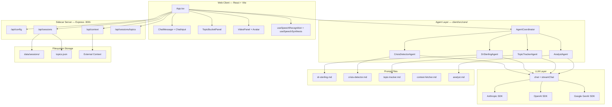
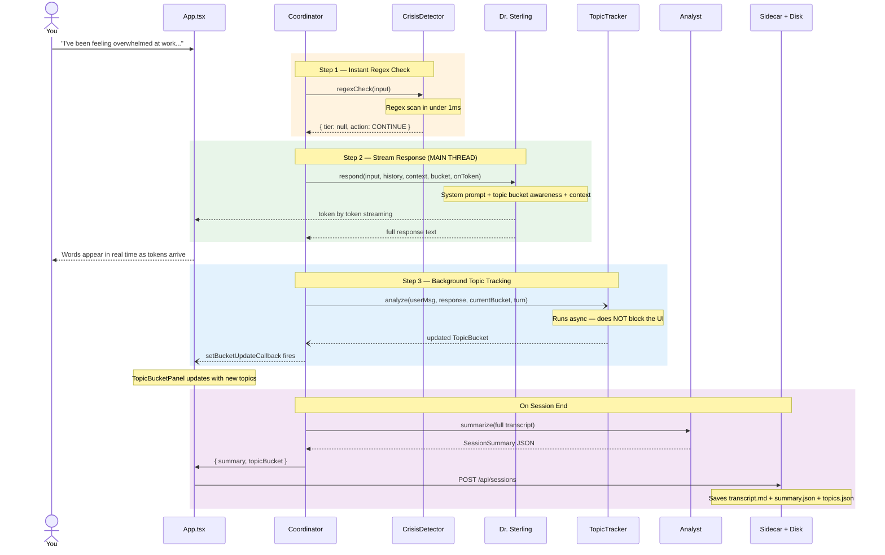
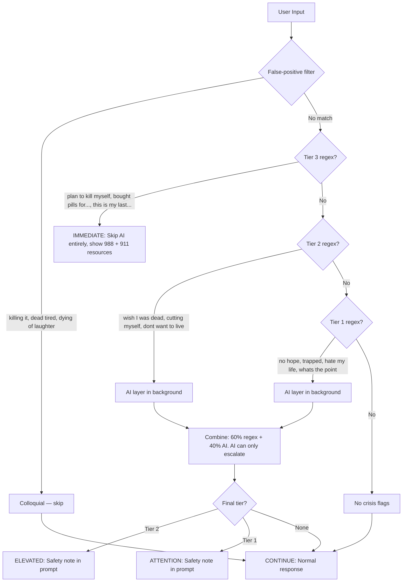
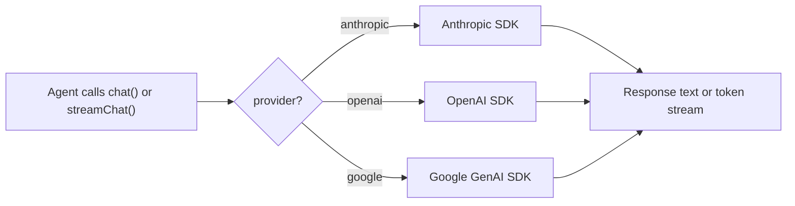

# AI Psychiatrist

A voice-enabled AI therapist with a React web interface. Talk to Dr. Eleanor Sterling -- a warm, concise AI psychiatrist backed by five coordinating agents, hybrid crisis detection, live topic tracking, and filesystem-only persistence. Responses stream in real time while background agents track discussion topics across sessions.

---

## What Happens When You Talk

You type (or speak via the browser microphone). Behind the UI, five agents handle every message -- most of them running in parallel so you never wait for anything except Dr. Sterling's actual words:

1. **CrisisDetector** -- regex scans your input in under 1ms. If the regex catches a Tier 3 pattern (active plan + method), it short-circuits everything and shows crisis resources immediately. For Tier 1-2 matches, an AI layer runs **in the background** while Dr. Sterling is already responding.

2. **Dr. Sterling** -- the primary therapist. Streams tokens to the UI in real time so you see words appearing as they're generated. Receives the topic bucket (what's been discussed, what's pending, emotional arc) as contextual awareness -- not as a checklist. If a crisis flag was raised, a safety note is injected into the system prompt.

3. **TopicTracker** -- runs in a **background thread** after Sterling finishes each turn. Analyzes the latest exchange and maintains a living "topic bucket" of everything discussed: active topics being explored, pending topics mentioned but not yet covered, resolved topics, session insights, and an emotional arc summary. This bucket feeds back into Sterling's next response and persists to disk for cross-session continuity.

4. **ContextFetcher** -- loads external context (patient profile, past session summaries, external notes) at session start. Context is set once and injected into every Sterling response.

5. **Analyst** -- runs when the session ends. Reads the full transcript and generates a structured summary: topics, emotional journey, key insights, recommendations, and risk assessment.

Sessions build on each other. Past session summaries **and** topic buckets are loaded at startup. Unresolved topics from previous sessions carry over automatically, so Dr. Sterling can naturally follow up on things that were mentioned but not fully explored.

---

## Architecture



---

## Message Processing Pipeline

The key principle: **Dr. Sterling streams first, everything else runs in the background**. The user sees words appearing within milliseconds of the LLM starting to generate.



The topic tracker's callback (`setBucketUpdateCallback`) fires asynchronously after the background analysis completes. The UI's `TopicBucketPanel` updates with animated bubbles showing topics flowing through the conversation.

### Sliding Window

When conversations exceed 30 messages, the coordinator compresses older messages into a system-level summary built from the topic bucket. The last 12 messages are kept verbatim. This prevents token overflow while preserving structured memory of everything discussed.

---

## Topic Tracker

The topic tracker maintains a living inventory of the conversation. Each topic has:

| Field | Purpose |
|-------|---------|
| `topic` | Short, specific label ("work stress from new project") |
| `depth` | `mentioned` → `exploring` → `deep` → `resolved` |
| `priority` | 1 (urgent) to 5 (low), re-sorted each turn by emotional weight |
| `notes` | Brief observations ("patient became emotional", "avoids going deeper") |
| `carryOver` | `true` if carried from a previous session |

Topics live in three buckets:
- **Active** -- currently being explored (depth: exploring or deep)
- **Pending** -- mentioned but not yet explored, sorted by priority
- **Resolved** -- sufficiently covered this session

The tracker also maintains:
- **Session insights** -- patterns noticed across topics ("connects work stress to relationship with father")
- **Emotional arc** -- one-line trajectory ("Started guarded, opened up about loneliness, became tearful, found humor, left reflective")

### Cross-Session Continuity

When a session ends, the topic bucket is saved as `topics.json` alongside the transcript and summary. At the next session start, the last 3 sessions' topic buckets are loaded and merged:

- Active topics that were never resolved become pending carry-overs
- Pending topics carry forward with a `[Carry-over]` note
- Resolved topics stay resolved for reference
- Dr. Sterling's greeting can naturally reference carry-over topics

The `TopicBucketPanel` in the UI auto-shows when carry-over topics are detected.

---

## Crisis Detection

The safety system is the only part that runs deterministic code before touching the LLM. False positives are always safer than false negatives.



**Key design constraints:**
- Tier 3 regex match = immediate response, zero LLM latency, hardcoded crisis resources
- AI layer can only *escalate* the tier -- if regex says Tier 1 and AI says Tier 2, final tier is 2. If regex says Tier 2 and AI says Tier 1, final tier stays 2.
- AI crisis check runs in the **background** -- Dr. Sterling is already streaming while the AI assessment resolves
- AI failure falls back to regex-only (safe default)
- False-positive patterns ("killing it at work", "dead serious") are checked before any tier matching

---

## Quick Start

### Prerequisites

- **Node.js 20+**
- **One API key**: Anthropic, OpenAI, or Google

### Install

```bash
git clone https://github.com/neerazz/ai-psychiatrist.git
cd ai-psychiatrist
npm install
cd client && npm install && cd ..
```

### Configure

```bash
cp .env.example .env
```

Open `.env` and set your API key:

```bash
AI_MODEL=claude-sonnet-4-5
ANTHROPIC_API_KEY=sk-ant-your-key-here
```

That's the minimum. Everything else has sensible defaults.

### Run the Web Client

```bash
npm run dev:web
```

This starts two processes:
- **Sidecar server** on `http://localhost:3001` -- handles file I/O, config, and session persistence
- **Vite dev server** on `http://localhost:5173` -- serves the React client

Open `http://localhost:5173` in your browser. Click "New Session" to begin.

The sidecar reads your `.env` and auto-configures the client -- no need to paste API keys into the UI (though you can override via Settings).

### Run the Terminal Client

```bash
npm run dev
```

The original terminal-based REPL still works. Type naturally. Say `goodbye`, `quit`, `exit`, or `bye` to end. The Analyst generates a summary and everything is saved to `data/sessions/`.

### Build for production

```bash
npm run build              # TypeScript → dist/ (terminal client)
cd client && npm run build # Vite → client/dist/ (web client)
```

---

## Configuration Reference

All settings are in `.env`. The model name prefix auto-selects the LLM provider.

### LLM

| Variable | Options | Default |
|----------|---------|---------|
| `AI_MODEL` | `claude-sonnet-4-5`, `claude-opus-4-6`, `gpt-5.2`, `gemini-3-pro` | `claude-sonnet-4-5` |
| `ANTHROPIC_API_KEY` | Your key | -- |
| `OPENAI_API_KEY` | Your key | -- |
| `GEMINI_API_KEY` | Your key | -- |

Only the key matching your chosen model needs to be set. The provider is inferred from the model name prefix (`claude-` -> Anthropic, `gpt-` -> OpenAI, `gemini-` -> Google).

### Audio (Terminal Client)

| Variable | Options | Default |
|----------|---------|---------|
| `AUDIO_PROVIDER` | `text`, `whisper_tts`, `gemini_live` | `text` |
| `WHISPER_MODEL` | `tiny`, `base`, `small`, `medium`, `large` | `base` |
| `TTS_PROVIDER` | `say` (macOS), `piper`, `edge` | `say` |

- **`text`** -- terminal stdin/stdout, no audio hardware needed
- **`whisper_tts`** -- local `whisper.cpp` for speech-to-text + configurable TTS
- **`gemini_live`** -- bidirectional streaming via Google's Gemini Live API

The web client uses the browser's built-in Web Speech API for both STT and TTS -- no configuration needed.

### Context

| Variable | Description | Default |
|----------|-------------|---------|
| `EXTERNAL_CONTEXT_PATHS` | Comma-separated files and/or directories | empty |
| `DATA_DIR` | Where sessions are saved | `./data/sessions` |

External context paths are read recursively at startup (`.json`, `.md`, `.txt`, `.yaml` files). This is how Dr. Sterling knows your history before you say a word.

---

## Project Structure

```
ai-psychiatrist/
├── .env.example              # Template — copy to .env
├── package.json
├── tsconfig.json
│
├── prompts/                  # Agent prompts (edit without touching code)
│   ├── dr-sterling.md        #   Therapist personality & techniques
│   ├── topic-tracker.md      #   Topic bucket analysis rules
│   ├── context-fetcher.md    #   Context relevance ranking rules
│   ├── crisis-detector.md    #   AI crisis analysis instructions
│   └── analyst.md            #   Session summary format & rules
│
├── client/                   # React web client (Vite + Tailwind)
│   ├── package.json
│   ├── vite.config.ts
│   ├── index.html
│   └── src/
│       ├── App.tsx           #   Main app — session lifecycle, bucket state
│       ├── main.tsx          #   React entry
│       ├── index.css         #   Tailwind + bucket animations
│       │
│       ├── components/
│       │   ├── ChatMessage.tsx       # Message bubbles (Markdown via react-markdown)
│       │   ├── ChatInput.tsx         # Text input + voice controls
│       │   ├── TopicBucketPanel.tsx  # Animated topic bucket visualization
│       │   ├── CrisisBanner.tsx      # Crisis alert banner
│       │   ├── SettingsPanel.tsx     # API key / model configuration
│       │   ├── VideoPanel.tsx        # 3D avatar + webcam feed
│       │   ├── TypingIndicator.tsx   # Animated typing dots
│       │   └── SterlingAvatar3D.tsx  # Three.js avatar component
│       │
│       ├── core/
│       │   ├── types.ts          # Types (TopicBucket, CrisisResult, etc.)
│       │   ├── llm.ts            # chat() + streamChat() — 3 providers
│       │   ├── prompts.ts        # Prompt loader (imports .md files)
│       │   ├── coordinator.ts    # Orchestrates 5 agents, sliding window
│       │   ├── api.ts            # Sidecar HTTP client
│       │   └── agents/
│       │       ├── dr-sterling.ts     # Streaming therapist + bucket awareness
│       │       ├── topic-tracker.ts   # Background topic analysis
│       │       ├── crisis-detector.ts # Regex + background AI
│       │       ├── context-fetcher.ts # Context ranking
│       │       └── analyst.ts         # Session summary
│       │
│       └── hooks/
│           ├── useSpeechRecognition.ts  # Web Speech API STT
│           └── useSpeechSynthesis.ts    # SpeechSynthesis TTS
│
├── server/                   # Sidecar — Express file I/O server
│   └── index.ts              #   /api/config, /context, /sessions, /sessions/topics
│
├── src/                      # Terminal client (original)
│   ├── index.ts              #   Entry — config, audio, agents, REPL loop
│   ├── types.ts              #   Shared types
│   ├── config.ts             #   Reads .env → Config object
│   ├── llm.ts                #   Unified chat() for terminal agents
│   ├── context.ts            #   Recursive file reader for external context
│   ├── session.ts            #   Save / load sessions + topic buckets
│   ├── audio/
│   │   ├── audio-interface.ts    # Abstract AudioInterface + TextProvider
│   │   ├── whisper-tts.ts        # Local STT (whisper.cpp) + TTS
│   │   └── gemini-live.ts        # Gemini Live bidirectional streaming
│   └── agents/
│       ├── coordinator.ts        # Terminal agent pipeline
│       ├── dr-sterling.ts
│       ├── context-fetcher.ts
│       ├── crisis-detector.ts
│       └── analyst.ts
│
└── data/sessions/            # Gitignored — created at runtime
    └── session_2026-02-06T19-38-59/
        ├── transcript.md     # Full conversation
        ├── metadata.json     # Date, message count
        ├── summary.md        # Human-readable summary
        ├── summary.json      # Structured (topics, insights, risk)
        └── topics.json       # Topic bucket for cross-session continuity
```

**5 prompt files. Two clients (web + terminal). One sidecar. Zero infrastructure.**

---

## Session Output

Each session creates a timestamped directory:

**`transcript.md`** -- the raw conversation:
```markdown
**user**: I've been feeling overwhelmed at work lately

**assistant**: That sounds like a lot of pressure building up. What specifically is making it feel overwhelming right now?
```

**`summary.json`** -- structured for machines:
```json
{
  "mainTopics": ["work-related anxiety", "perfectionism patterns"],
  "emotionalJourney": "Started frustrated, shifted to reflective after reframing",
  "keyInsights": ["Recognized 'gaining marks' behavior as anxiety-driven"],
  "recommendations": ["Explore boundary-setting at work"],
  "riskAssessment": "low — no safety concerns"
}
```

**`topics.json`** -- the topic bucket at session end:
```json
{
  "active": [],
  "pending": [
    {
      "id": "boundary-setting-at-work",
      "topic": "boundary-setting at work",
      "depth": "mentioned",
      "priority": 2,
      "turnMentioned": 7,
      "turnLastTouched": 7,
      "relatedTopics": ["work-stress-new-project"],
      "notes": "recommended but not yet explored"
    }
  ],
  "resolved": [
    {
      "id": "work-stress-new-project",
      "topic": "work stress from new project",
      "depth": "resolved",
      "priority": 1,
      "turnMentioned": 1,
      "turnLastTouched": 6,
      "relatedTopics": ["perfectionism-patterns"],
      "notes": "patient connected this to perfectionism; had insight about self-imposed deadlines"
    }
  ],
  "sessionInsights": [
    "Patient connects work stress to self-imposed perfectionism standards",
    "Shifted from externalizing blame to recognizing own patterns"
  ],
  "emotionalArc": "Frustrated → reflective → surprised by own insight → cautiously hopeful",
  "turnCount": 8
}
```

Pending topics in `topics.json` automatically carry over to the next session. Dr. Sterling sees them as gentle suggestions -- not a rigid agenda -- and can naturally follow up when there's an opening.

**`summary.md`** -- readable for humans (same data as summary.json, formatted as headings and bullet points).

**`metadata.json`** -- date and message count.

---

## How the LLM Layer Works

The web client's `llm.ts` exposes two functions: `chat()` for standard request-response and `streamChat()` for real-time token streaming. All five agents call one or the other. Each function lazily initializes the SDK client matching your chosen provider:



Dr. Sterling uses `streamChat()` -- tokens arrive one at a time and are pushed to the UI via the `onToken` callback. All other agents use the standard `chat()` function.

Each provider has its own message formatting (Anthropic uses a separate `system` parameter, OpenAI prepends a system message, Google uses `systemInstruction` + chat history). The LLM layer handles all of this -- agents just pass messages and get text back.

---

## Voice in the Browser

The web client uses the browser's built-in speech APIs -- no external services or API keys needed for voice.

**Speech-to-Text**: `useSpeechRecognition` hook wraps the Web Speech API. Shows interim (partial) transcripts in real time above the input field as you speak. The final transcript auto-sends when you stop talking.

**Text-to-Speech**: `useSpeechSynthesis` hook wraps `SpeechSynthesis`. Long responses are split into chunks to work around Chrome's 15-second TTS cutoff bug. A keepalive interval pauses and resumes the synthesis engine every 10 seconds to prevent Chrome from silently killing the audio.

After Dr. Sterling finishes speaking, the microphone automatically restarts for the next turn -- creating a continuous conversational flow.

---

## Extending

### Add a new agent

1. Write `prompts/your-agent.md` with the system prompt
2. Create `client/src/core/agents/your-agent.ts` -- accept `ChatFunction`, call it, return structured output
3. Import the prompt in `client/src/core/prompts.ts`
4. Wire it into `AgentCoordinator.processInput()` in `coordinator.ts` -- either in the main thread or as a background `.then()` like the TopicTracker

### Switch LLM providers

Change one line in `.env`:

```bash
AI_MODEL=gpt-5.2
```

The model prefix auto-selects the provider. Set the matching API key and you're done. Both the terminal and web clients read from the same `.env`.

### Modify Dr. Sterling's personality

Edit `prompts/dr-sterling.md`. No code changes needed. The prompt is loaded at startup. You can change the therapeutic approach, communication style, or session flow rules and restart.

### Customize the topic tracker

Edit `prompts/topic-tracker.md` to change how topics are categorized, prioritized, or when they're marked as resolved. The tracker outputs structured JSON, so changes to the prompt affect the bucket contents without touching any code.

---

## Design Decisions

| Decision | Why |
|----------|-----|
| **Streaming-first responses** | The user sees Dr. Sterling's words appearing in real time. Everything else (crisis AI, topic tracking) runs in the background. Perceived latency drops to first-token time rather than full-response time. |
| **Topic bucket as structured memory** | Raw transcripts are hard to query. The topic bucket gives the therapist agent a living, sorted inventory of what's been discussed, what's pending, and what patterns are emerging -- without re-reading the full history. |
| **Background topic tracking** | The TopicTracker fires after Sterling finishes (`.then()`, not `await`). It never adds latency to the conversation. The UI updates asynchronously when the analysis completes. |
| **Sliding window with bucket compression** | After 30 messages, older messages are replaced with a system-level summary built from the topic bucket. The model keeps full context of recent exchanges and structured memory of older ones. |
| **Cross-session topic carry-over** | Unresolved topics from past sessions become pending carry-overs in the next session. This gives Dr. Sterling natural follow-up material without forcing an agenda. |
| **Filesystem, not a database** | One user, one machine. Markdown and JSON files are inspectable, diffable, and grep-friendly. No migrations, no connection strings, no ORM. |
| **Sidecar server for file I/O** | The browser can't read/write the filesystem. A thin Express server on `:3001` handles config loading, context reading, and session persistence. It reads `.env` so the client auto-configures without manual API key entry. |
| **Regex runs first in crisis detection** | Deterministic patterns execute in <1ms and cannot be influenced by prompt injection. The AI layer adds nuance but can never suppress a regex match. |
| **AI can only escalate, never downgrade** | A false negative in crisis detection is unacceptable. If regex says Tier 1 and AI says "actually fine," the system keeps Tier 1. The reverse (AI upgrading to a higher tier) is allowed. |
| **Separate prompt files** | Edit Dr. Sterling's personality or the topic tracker's rules without touching TypeScript. Version-control prompts independently from code. |
| **Lazy SDK initialization** | The Anthropic, OpenAI, and Google clients are only created when first called. If you set `AI_MODEL=claude-sonnet-4-5`, the OpenAI and Google SDKs are never instantiated. |

---

## Tech Stack

| Category | What |
|----------|------|
| Runtime | Node.js 20+ / TypeScript 5.9 |
| Web Client | React 19 · Vite 7 · Tailwind CSS 4 |
| Rendering | `react-markdown` for LLM output |
| LLM SDKs | `@anthropic-ai/sdk` · `openai` · `@google/generative-ai` |
| Sidecar | Express 5 (file I/O, config, sessions) |
| Browser Voice | Web Speech API (STT) · SpeechSynthesis (TTS) |
| Terminal Voice | `nodejs-whisper` (local whisper.cpp) · Gemini Live API |
| TTS (terminal) | macOS `say` · Piper · Edge TTS |
| Storage | Filesystem only (`.md` + `.json`) |
| Infrastructure | None. No database, no Docker, no containers. |
